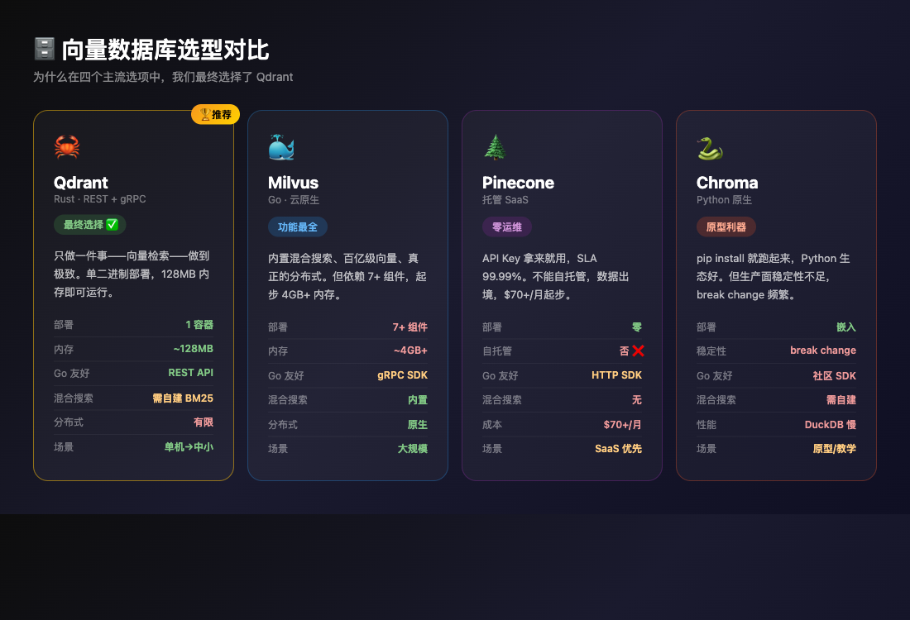
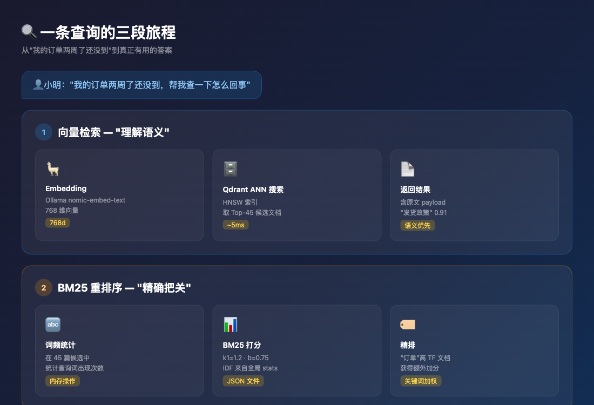
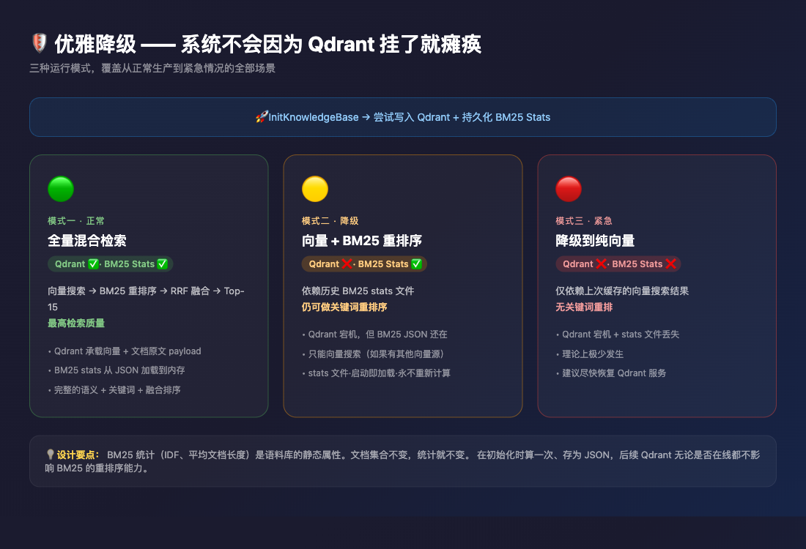
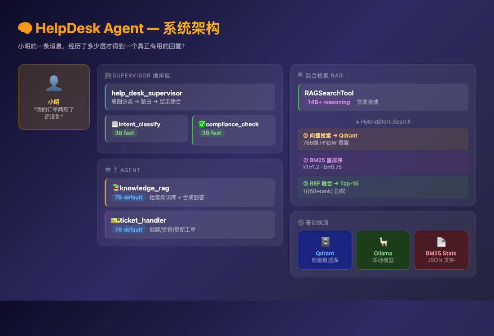

# RAG 落地避坑记：向量数据库怎么选，管线怎么搭

## 引子

小明发来的那条消息最终被接住了——Agent 分类了意图、检索了知识库、查了订单系统，给出了一个真正有用的回复。

但作为架构师，新的问题摆在面前：

**这套系统怎么落地？**

上一篇文章聊了检索算法的演进（关键词 → 向量 → 混合 → Agentic），但那是在理论上。真正把系统跑起来的时候，你会发现有一堆更"俗"的问题：

- 向量存在哪里？内存里还是专门的数据库？
- 如果用专门的向量数据库，用哪个？Qdrant、Milvus、Pinecone、Chroma 有什么区别？
- BM25 的倒排索引和 IDF 统计怎么维护？每次启动重新算一遍？
- 向量数据库挂了怎么办？
- 整条管线的延迟怎么样？

下面我们从架构选型的角度，把这些问题逐个拆开。

---

## 第一章：从"存哪儿"说起

### 一开始的想法：全部放内存

最朴素的做法——文档不多（几十篇），Embedding 向量也不大（768 维），那直接放内存呗：

```go
type HybridStore struct {
    docs      []Doc           // 文档原文，给 BM25 用
    vectors   [][]float64     // 向量，给语义搜索用
    nTerms    map[string]int  // 词频统计，给 BM25 用
}
```

启动时加载全部文档 → 算一遍 BM25 统计 → 每篇调 Ollama 生成向量 → 查询时遍历 BM25 + 遍历向量 → RRF 融合。

**听起来挺美的，但问题藏在水下：**

**问题一：文档量稍微一大就扛不住。** 几十篇文档没问题，几万篇呢？几十万篇呢？每次查询都遍历全量文档做 BM25 和向量对比，O(n) 复杂度，到 10 万篇时延迟已经是秒级了。

**问题二：BM25 统计是活的还是死的？** 文档集合不变的时候，IDF、平均文档长度是常量。但如果你要热更新文档（加一条退货政策、改一下发货说明），就得重新算全量统计。算的过程中要不要锁？并发来了怎么办？

**问题三：启动速度。** 每次重启都得重新 Embed 所有文档，调一遍 Ollama API。5 篇文档还好，5000 篇的话，你重启一次服务器得等好几分钟。

### 正经的架构师会怎么做

"文档不全部加载进内存"才是生产级的做法。你需要把存储职责外置：

- **向量** → 交给专门的向量数据库（Qdrant / Milvus / ...），由它负责 ANN（近似最近邻）检索，时间复杂度降到 O(log n)
- **文档原文** → 存在向量数据库的 payload 里，检索时顺带取出。或者存在专门的文档库里
- **BM25 统计** → 预计算 + 持久化到磁盘，启动时加载，不重复计算

这就引出了最核心的选型问题：**向量数据库，选哪个？**

---

## 第二章：向量数据库选型——不是选择题，是取舍题

我们评估了四个主流的选项：

### Qdrant（最终胜出）

**技术画像**：Rust 实现，单二进制，REST + gRPC 双协议。

Qdrant 的核心竞争力不在于功能多，而在于**设计目标的克制**。它只做一件事——向量检索——把它做到了极致。

```
// 一个 Qdrant 查询请求
POST /collections/helpdesk_kb/points/search
{
    "vector": [0.01, 0.02, ..., 0.76],  // 768 维
    "limit": 15,
    "with_payload": true                 // 把文档原文也带回来
}
```

返回结果里直接带着 payload，不需要二次查询。**一次网络往返，向量 + 原文都拿到了。**

它的资源消耗也极其友好：一个 Docker 容器，128MB 内存就能跑起来，适合开发者笔记本和单机部署。

**但 Qdrant 有两个需要接受的局限性：**

第一，它没有内置的 BM25 全文检索。如果你想要混合搜索（关键词 + 向量），得自己在客户端做——从 Qdrant 取出向量结果，再在上面跑 BM25 算分。这不像 Elasticsearch 那样开箱即用。

第二，它不是分布式的。单机能扛的向量量级在千万左右，再往上就需要手动分片了。

**对于我们这个场景（单机、小规模、数万篇文档级别），这两个局限根本不构成问题。**

### Milvus

**技术画像**：Go 实现，云原生架构，依赖 etcd + MinIO/S3 + 多个组件。

Milvus 是功能最全的选择：内置 BM25 混合检索（2.4+）、真正的分布式架构、百亿级向量能力、丰富的索引类型（IVF、HNSW、DiskANN）。

**但代价巨大：**

```
$ docker-compose ps
    Name                   Status
──────────────────────────────────────
milvus-etcd              running
milvus-minio             running
milvus-proxy             running
milvus-querycoord        running
milvus-datacoord         running
milvus-indexcoord        running
...
```

一个 Milvus 集群光是依赖就 etcd + MinIO + 七八个内部组件。资源起步 4GB+ 内存，启动时间分钟级。

对于单机场景来说，Milvus 是一个"为了一个功能背了整个数据中心"的选择。

此外，Milvus SDK 的设计偏"数据库思维"——有 collection schema、分区、索引配置、加载/释放的显式生命周期管理。对于 Go 开发者来说，接口风格不如 Qdrant 的 REST API 来得直观。

### Pinecone

**技术画像**：全托管 SaaS，不能自托管。

Pinecone 的优势是零运维——API Key 拿来就用，扩缩容自动完成，SLA 99.99%。

**但不可接受的代价：**

数据控制权全部交给第三方。你的知识库文档（可能包含业务敏感信息）必须经过 Pinecone 的服务器。对于电商客服场景，这基本上是一票否决的——订单数据、客户信息不能承诺永远不出供应商网络边界。

还有一个更实际的问题：**Pinecone 是按向量存储量和查询量计费的**。一个 Index 起步 $70/月，随着文档量增长可以快速翻倍。对于小团队来说，这个成本远比自托管 Qdrant 高。

### Chroma

**技术画像**：Python 原生，嵌入式，可以跑在进程内。

Chroma 在原型阶段非常爽——`pip install chromadb` 就跑起来了，API 极为 Pythonic。但它在生产面有多个硬伤：

- **稳定性**：0.4.x 到 0.5.x 的 API break change 不断，存储格式也不兼容
- **性能**：底层是 DuckDB + Flat 索引，大数据量下 ANN 检索没有 Qdrant 的 HNSW 快
- **Go 生态**：Chroma 的 Go SDK 是社区维护的，不如 Qdrant 的 REST API 可靠
- **并发**：Chroma 的默认嵌入模式有 GIL 问题，多 goroutine 写入时需要额外加锁

### 选型矩阵

| 维度 | Qdrant | Milvus | Pinecone | Chroma |
|------|--------|--------|----------|--------|
| 部署复杂度 | 低（1 容器） | 高（7+ 组件） | 零（托管） | 极低（嵌入） |
| 资源占用 | ~128MB | ~4GB+ | N/A | ~200MB |
| 自托管 | 是 | 是 | 否 | 是 |
| Go 友好度 | REST，直接 http 调用 | gRPC SDK | HTTP SDK | 社区 SDK |
| 混合搜索 | 需自建 BM25 | 内置 | 无 | 需自建 |
| 分布式 | 有限 | 原生支持 | 自动 | 不支持 |
| 适合场景 | **单机到中小规模** | 大规模生产 | SaaS 优先 | 原型/教学 |

> **结论很直接：** 我们这个场景——单机 Ollama + 数万篇电商知识库 + Go 技术栈——Qdrant 是唯一一个在"够用"和"不重"之间取得平衡的选项。



---

## 第三章：管线设计——我们到底是怎么"混合"的

向量数据库定了，接下来是检索管线的具体设计。

### 一个常见的误区

很多人理解的"混合检索"是这样的：

```
用户查询 → 同时查 BM25 和向量 → 各自取 Top-N → RRF 融合
```

**这个方案在工程上有问题：** 要同时维护两套数据源。BM25 需要全文倒排索引（意味着 Elasticsearch 或类似组件），向量需要 Qdrant。为了做混合搜索，你引入了两个存储系统，任何一个出问题都会影响检索。

尤其对于中小团队来说，运维 Elasticsearch + Qdrant 两套系统是一个非常沉重的负担。

### 我们的方案：二阶段非对称检索



**核心设计思路是：向量做主检索，BM25 做辅助精排，而不是两者并列。**

解释一下为什么这样设计：

**第一，向量检索是语义兜底。** 无论用户怎么措辞——"退货"、"退款"、"退钱"、"refund"——向量都能匹配到正确的文档。这是检索的第一道关卡，不能漏。

**第二，BM25 只作用于向量检索已经找到的候选集。** 向量找出 Top-45（Top-15 × 3），BM25 在这 45 篇上算分，然后 RRF 融合。而不是在全量文档上跑 BM25——那样你需要全文倒排索引，复杂度高很多。

**第三，BM25 不依赖外部存储。** 我们只在初始化时算一次语料统计（IDF、平均文档长度），存成一个 JSON 文件：

```json
{
    "avg_doc_len": 42.5,
    "total_docs": 5,
    "n_terms": {
        "shipping": 3,
        "return": 2,
        "orders": 2,
        "payment": 1,
        "account": 1
    }
}
```

启动时 `LoadStats` 读到内存，查询时直接用。文档原文存在 Qdrant payload 里，BM25 只需要从 payload 里取出来做词频统计。

**这意味着一件事：我们的 BM25 不需要额外的存储组件。** 没有 Elasticsearch，没有 Meilisearch，只有一个 JSON 文件。

### Graceful Degradation（优雅降级）

这个设计的另一个好处——**容错**。

```go
// 初始化：尝试写 Qdrant，不行就 LoadStats 兜底
if err := InitKnowledgeBase(ctx, kb, loader); err != nil {
    log.Printf("qdrant 不可用: %v", err)
    if err := kb.LoadStats(statsPath); err != nil {
        log.Printf("也没有 BM25 stats，纯向量模式: %v", err)
    }
}
```

三种运行模式：

| 状态 | 效果 | 使用场景 |
|------|------|----------|
| Qdrant 正常 | 向量 + BM25 + RRF 全量 | 正常生产 |
| Qdrant 挂了，有 BM25 stats | 退化为向量搜索 + BM25 重排序 | 上线后 Qdrant 宕机 |
| Qdrant 挂了，也没有 stats | 只能用上次缓存的向量结果 | 紧急降级 |

注意第三种情况其实几乎不会发生——`statsPath` 一旦写入，只要不删文件就永远可用。Qdrant 宕机时，你至少还有 BM25 能做最后一层检索。



---

## 第四章：关于 Reranker 的取舍

上一篇文章提到了 Reranker（Cross-encoder 重排序器），但我们的实际实现里**并没有加**。

为什么？

**Reranker 的目的**：对 RRF 融合后的 Top-20 逐对算分，过滤掉语义不相关但被错误排进来的文档。

**不加的理由**：

1. **增加了一次模型调用**——Cross-encoder 比 Bi-encoder 慢一个数量级。对于实时客服场景，多一次几百毫秒的推理意味着用户能感知到的延迟。
2. **我们的知识库质量较高**——文档都是人工写的政策和帮助信息，没有大规模爬虫带来的脏数据。BM25 + 向量 + RRF 已经能取得不错的效果。
3. **最终输出有 LLM 把关**——检索结果喂给 LLM 之后，LLM 自己有能力判断哪些信息是相关的。LLM 本身就是一个隐式的 Reranker。

**什么时候应该加？**

- 知识库规模大（万篇以上），且有多源异构数据
- 检索结果中频繁出现"看起来相关实际不相关"的文档
- 用户反馈 LLM 的回答经常被干扰信息带偏

在我们当前的规模下，Reranker 的收益抵不上它引入的延迟和运维成本。但如果未来知识库膨胀到一定规模，它会是下一个需要加上的环节。

---

## 第五章：整套系统的架构全貌

把前面所有的决策串起来，这就是我们最终的架构：



几个关键的设计决策：

**模型路由**：不是所有任务都需要大模型。意图分类和合规检查用 3B 小模型就够，Supervisor 和工具调用用 7B，只有 RAG 答案合成用大模型（14B+）。这就是 `ModelRouter` 的设计——每个角色可独立配置模型，不配置时自动降级到默认值。

**Embedder 同样是可替换的**：当前用的是 Ollama 的 `nomic-embed-text`（768 维），但如果切换到 OpenAI 的 `text-embedding-3-small`（1536 维）或者 Cohere 的 `embed-multilingual-v3.0`，只需要实现 `Embedder` 接口：

```go
type Embedder interface {
    Embed(ctx context.Context, text string) ([]float64, error)
}
```

**BM25 统计与 Qdrant 分离**：统计信息是静态的，存文件；文档和向量是动态的，存 Qdrant。两者独立生命周期，互不依赖。

---

## 总结

回到最初的问题：一套 RAG 系统落地，到底需要哪些组件？

```
组件:     选型:             成本:
向量库     Qdrant           轻量，自托管
Embedding  Ollama nomic-embed-text  免费，本地
LLM        Ollama qwen2.5    免费，本地
BM25       客户端 + JSON 文件    零额外组件
编排框架   Eino ADK          Go 原生
```

**不需要 Elasticsearch、不需要 Redis、不需要额外的全文检索引擎。**

这个组合能覆盖到的生产场景是：文档量在十万篇以下、查询 QPS 在几十到几百、团队规模不大的 RAG 应用。

如果你的场景超出了这个范围——比如文档量到百万级、需要分布式、或者 QPS 上千——那 Qdrant 可能不够用了，需要往 Milvus 或 Elasticsearch 方向升级。但大多数团队在到达那个量级之前，已经能跑很久很久了。

---

## 参考

- [Qdrant 官方文档 — Architecture](https://qdrant.tech/documentation/concepts/architecture/)
- [Milvus 架构概览](https://milvus.io/docs/architecture_overview.md)
- [Pinecone 定价](https://www.pinecone.io/pricing/)
- [Chroma — 0.4.x vs 0.5.x breaking changes](https://docs.trychroma.com/migration)
- [Elastic — Building production AI agents](https://www.elastic.co/blog/building-ai-agents-elasticsearch-platform)
